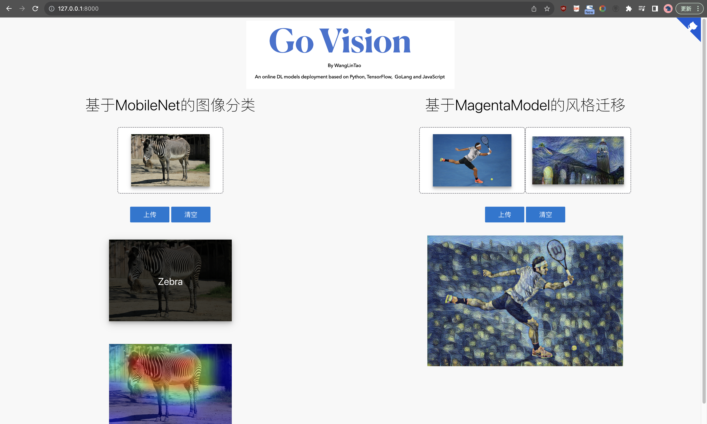
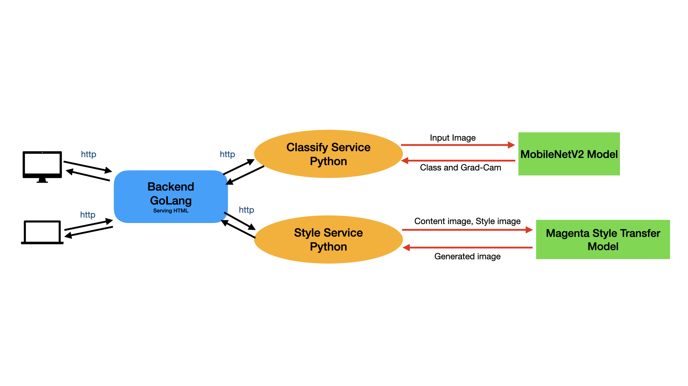

# GoVision （202134061002 王林韬）

## 功能介绍
GoVision是一款基于深度学习模型部署的在线图像分类和风格迁移应用。其主要包含两个功能 (1) 基于MobileNetV2模型的图像分类功能和 (2) 基于MagentaModel的风格迁移功能。功能（1）不仅可以给出用户输入的图像对应的类别，还利用了Grad-Cam技术，通过将相关热力图和输入图像进行叠加展示，帮助用户理解模型在图像分类任务中的决策依据，即哪些图像区域对于模型的分类结果起到了关键作用。功能（2）是图像的风格迁移服务，用户可以选择一张图片作为内容图片(content image)和一张图片作为风格图片(style image)，模型通过将风格图片的颜色、纹理、形状等特征迁移到内容图片上，使得一幅图像以另一幅图像的风格呈现，实现自动美化图片。如下是本应用的web用户界面。


#### 用户界面


#### 基于MobileNetV2的图像分类
MobileNetV2是一种轻量级的卷积神经网络（CNN）模型，旨在在移动设备和嵌入式设备上实现高效的图像分类和目标识别任务。它是MobileNet系列模型的第二代，相较于MobileNetV1，MobileNetV2具有更高的准确性和更低的计算复杂度。MobileNetV2的设计思想主要包括以下几个方面：

##### 1.倒残差结构:
MobileNetV2引入了倒残差结构，即先扩张维度，再深度可分离卷积，最后再压缩维度。这种结构可以有效地减少参数数量和计算量，同时保持较好的准确性。
##### 2.瓶颈结构:
MobileNetV2采用了瓶颈结构，通过使用1x1卷积层来减少通道数，然后再使用3x3深度可分离卷积层，最后再使用1x1卷积层恢复通道数。这种结构可以进一步减少计算量，并提高模型的非线性表示能力。
##### 3.线性瓶颈:
MobileNetV2在瓶颈结构中引入了线性瓶颈，即在扩张层和压缩层之间使用线性激活函数，以增加模型的表达能力。
##### 4.SE模块:
MobileNetV2还引入了SE（Squeeze-and-Excitation）模块，用于自适应地调整通道的重要性。SE模块通过全局平均池化和全连接层来学习通道的权重，进一步提高模型的准确性。

本应用选择此模型是因为，MobileNetV2在参数量和计算量上都比较小，适合在资源受限的设备上进行部署，也具备较快的推理速度。它在图像分类、目标检测和图像分割等任务中都有广泛的应用，并在多个数据集上取得了较好的性能。

### 基于Grad-Cam技术的可解释型AI
Grad-CAM（Gradient-weighted Class Activation Mapping）是一种用于可视化和解释卷积神经网络模型的方法。它可以帮助理解模型在图像分类任务中的决策依据，即哪些图像区域对于模型的分类结果起到了关键作用。

Grad-CAM的核心思想是通过计算特征图的梯度，确定模型对于不同类别的分类决策在特征图上的空间位置。它通过将梯度与特征图相乘，得到每个通道的权重，然后将权重与特征图相加得到类别激活图。这样，可以直观地看到模型关注的图像区域。

Grad-CAM具有以下优点：

##### 1.不需要修改模型结构:
Grad-CAM是一种模型无关的方法，可以应用于任何CNN模型，而不需要改变网络结构。即可以用来评估任何图像分类模型的可解释性。

##### 2.直观可视化:
Grad-CAM生成的类别激活图可以直观地展示模型对于分类决策的依据，可以帮助理解模型的决策过程。

##### 3.空间位置信息:
Grad-CAM可以提供模型在图像中关注的具体位置，可以帮助用户理解模型对于不同区域的感知能力。

Grad-CAM已经在图像分类、目标检测和图像分割等任务中得到广泛应用。它不仅可以用于模型解释和可视化，还可以用于模型的调试和改进。通过分析类别激活图，可以发现模型可能存在的问题，并采取相应的措施进行优化。部署方面，使用Grad-Cam不包含复杂的训练过程，并不会在后台带来很大的负载，也具备较低的处理延迟。有关Grad-Cam的具体细节可以参考论文:
`Grad-CAM: Visual Explanations from Deep Networks via Gradient-based Localization (https://arxiv.org/abs/1610.02391)`

#### 基于Magenta的图像风格迁移
风格迁移是一种将一幅图像的风格应用于另一幅图像的技术。它结合了计算机视觉和机器学习的方法，通过改变图像的颜色、纹理、形状等特征，使得一幅图像以另一幅图像的风格呈现。

风格迁移的核心思想是将图像分解为内容和风格两个部分，并通过优化算法将两个部分重新组合在一起。一般来说，内容是指图像的物体、结构和布局等方面，而风格则包括图像的纹理、颜色和艺术风格等方面。

风格迁移的方法有很多种，其中一种常用的方法是基于卷积神经网络（CNN）的方法。这种方法通过将预训练的CNN网络分为内容网络和风格网络，分别提取图像的内容特征和风格特征。然后，通过优化算法将输入图像的内容特征与目标图像的内容特征匹配，并将输入图像的风格特征与目标图像的风格特征匹配。最终，将匹配后的内容特征和风格特征合成为一幅新的图像。

风格迁移不仅可以应用于图像，还可以应用于视频和音频等领域。它在艺术创作、图像处理和娱乐等方面具有广泛的应用。通过风格迁移，可以创造出独特的艺术作品，改变图像的风格，甚至实现虚拟现实和增强现实等技术的效果。

Magenta是一个由Google Brain团队开发的开源项目，旨在探索和推动机器学习在创造性领域的应用。在Magenta中，有一个名为"magenta.models.image_stylization"的模块，提供了用于图像风格迁移的模型。

Magenta的图像风格迁移模型基于卷积神经网络（CNN）和生成对抗网络（GAN）的思想。它能够将一幅图像的风格应用于另一幅图像，生成具有目标图像风格的合成图像。

该模型的训练过程包括两个关键步骤：

##### 1.风格编码器训练:
首先，使用大量具有不同风格的图像对模型进行训练。模型通过编码器将输入图像转换为风格向量，然后通过解码器将风格向量还原为图像。编码器和解码器之间的损失函数旨在最小化输入图像与重建图像之间的差异。
##### 2.风格迁移训练:
接下来，使用一对配对图像（一幅图像作为内容图像，另一幅图像作为风格图像）对模型进行训练。模型通过编码器将内容图像编码为内容向量，通过解码器将内容向量和风格向量合成为风格化的图像。训练过程中的损失函数旨在最小化内容图像与风格化图像之间的内容差异，并最大化风格图像与风格化图像之间的风格一致性。
训练完成后，该模型可以接受任意的内容图像和风格图像，并生成具有目标风格的合成图像。用户可以通过调整输入图像的内容权重和风格权重，来控制合成图像的内容和风格特征的相对重要性。

Magenta的图像风格迁移模型在艺术创作和图像处理等领域具有广泛的应用，可以生成独特的艺术作品，并帮助用户实现个性化的图像风格转换。

## 应用实现

##### 1.编程语言和相关技术栈:
前端页面渲染和交互: JavaScript, html, css
后台: Golang, Python
深度学习框架: TensorFlow
Web框架: Gin (Golang), Flask (Python)

##### 2.架构
本应用的前端使用js来进行页面的交互和http请求和响应的发送、接收、渲染，后端采用Golang的gin框架搭建一个用来合理转发用户请求的网关。
因为考虑到应用的低耦合性，开发时选择将处理请求的后台和进行模型部署的服务分离开来，因为Python语言在深度学习模型部署方面的优势，编写了两个独立的服务，分别用来处理网关发送过来的图像分类请求和图像风格迁移请求。Python服务在服务开启时即会加载训练好的本地模型到内存中，等待网关发送来的请求。Python端主要利用了Flask框架来和Golang网关进行基于http协议的通信，利用TensorFlow框架进行模型的预加载和正向推演，利用Numpy作为基本的图像数据处理模块。在Classify服务中，在每次得到模型预测的类别后，会调用相应的Grad-Cam模块来生成相关热力图，如上图中的斑马，可以帮助理解模型是如何在分类中做出决策的。

##### 3.源文件结构:
######  (1) back文件夹: Golang网关相关的源代码。
######  (2) classify_app.py: 实现图像分类和Grad-Cam的Python源代码。
######  (3) style_app.py: 实现风格迁移的Python源代码。
######  (4) makefile: 自动化工具。

## 使用指南

1. ```make classify``` 开启图像分类服务

2. ```make style``` 开启风格迁移服务

3. ```make backend``` 开启网关服务
   
开启过程中按照程序提示安装相应的python或者golang的依赖即可。
使用视频.mov 文件是一个本地运行的实例视频。